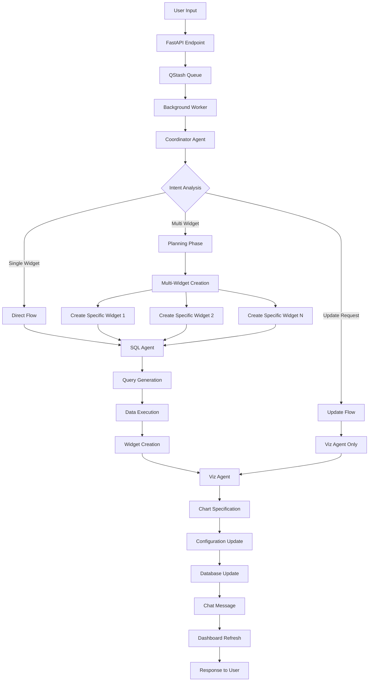
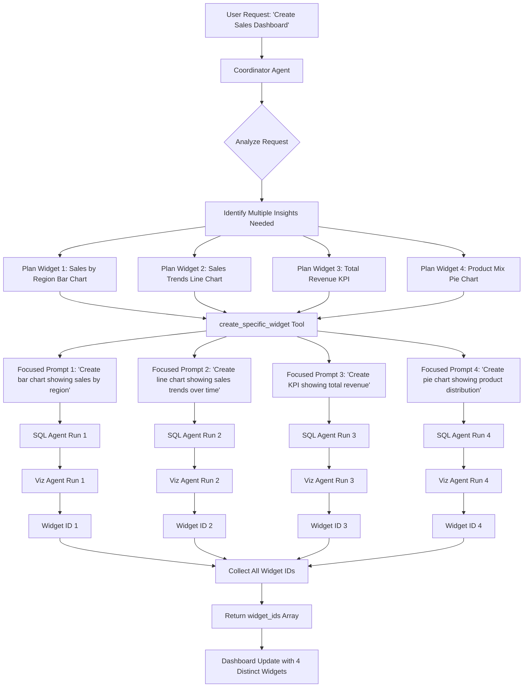
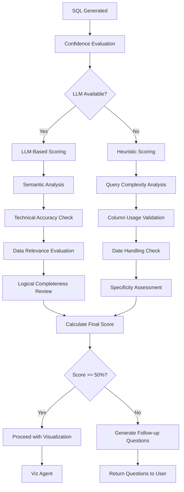

# Agentic Flow Documentation

## Overview

The GenAI DataVis backend implements a sophisticated multi-agent orchestration system that processes natural language prompts and generates intelligent data visualizations. The system uses a hierarchical agent architecture powered by Pydantic AI, with specialized agents for different aspects of the data visualization pipeline.

## System Architecture

### Core Principles
- **Hierarchical Agent Design**: Coordinator delegates to specialized agents
- **Safety First**: Multiple validation layers prevent dangerous operations
- **Intelligence-Driven**: Confidence scoring ensures quality outputs
- **Context Aware**: Maintains conversation and dashboard state
- **Scalable**: Queue-based processing handles concurrent requests

## Agent Ecosystem

### 1. Coordinator Agent 🎯
**Primary Orchestrator** - The main decision-making agent that manages the entire workflow

**Location**: `apps/backend/services/coordinator_agent.py`

**Key Responsibilities:**
- Intent analysis and task delegation
- Workflow coordination between specialized agents
- Multi-widget generation planning
- Confidence threshold management (50% minimum)
- Follow-up question generation for unclear requests

**Available Tools:**
```python
@coordinator_agent.tool
async def generate_sql(ctx: RunContext[Deps]) -> SQLOutput:
    """Delegates SQL generation to the SQL agent"""

@coordinator_agent.tool  
async def visualize_chart(ctx: RunContext[Deps], widget_id: str) -> dict:
    """Delegates chart visualization to the Viz agent"""

@coordinator_agent.tool
async def create_specific_widget(ctx: RunContext[Deps], 
                               widget_description: str, 
                               chart_type: str, 
                               focus_area: str) -> str:
    """Creates targeted widgets with specific purposes for multi-widget scenarios"""
```

**Multi-Widget Generation Logic:**
1. **ANALYZE**: Parse user request for multiple visualization needs
2. **PLAN**: Design distinct widgets with unique purposes
3. **EXECUTE**: Call `create_specific_widget` multiple times  
4. **COLLECT**: Return all widget IDs in response

**Confidence Scoring Integration:**
- Uses both LLM-based and heuristic confidence evaluation
- Blocks execution below 50% confidence threshold
- Generates clarifying questions for improvement

---

### 2. SQL Agent 💾
**Data Query Specialist** - Handles all SQL generation, execution, and data validation

**Location**: `apps/backend/services/sql_agent.py`

**Key Responsibilities:**
- DuckDB SQL query generation with strict schema adherence
- Data validation and safety checks (prevents DELETE, DROP, etc.)
- Widget creation in Supabase database
- Column type inference and date handling
- Query confidence scoring

**Available Tools:**
```python
@sql_agent.tool
async def calculate(ctx: RunContext[Deps], sql_query: str) -> str:
    """Executes SQL queries safely and creates widget records"""

@sql_agent.tool
async def get_column_unique_values(ctx: RunContext[Deps], 
                                 file_id: str, 
                                 column_name: str) -> list[str]:
    """Retrieves unique values for data exploration"""

@sql_agent.tool
async def calculate_confidence(ctx: RunContext[Deps], 
                             confidence_input: ConfidenceInput) -> tuple[int, str]:
    """Evaluates query quality with detailed reasoning"""
```

**Safety Features:**
- SQL injection prevention through parameterization
- Query validation against dangerous operations
- Schema enforcement and type checking
- Result size limitations

**Database Integration:**
- Creates widget records with UUIDs
- Manages widget layouts and grid positioning
- Links widgets to dashboards and chat sessions
- Stores SQL queries for reproducibility

---

### 3. Visualization Agent 🎨
**Chart Specification Expert** - Handles all chart configuration and styling

**Location**: `apps/backend/services/viz_agent.py`

**Key Responsibilities:**
- Chart specification generation for 6 chart types
- Advanced styling and configuration management
- Color palette and theme application
- Data binding and transformation logic
- Real-time chart updates

**Available Tools:**
```python
@viz_agent.tool
async def visualize_bar(ctx: RunContext[Deps], chart_config: BarChartConfig) -> str:
    """Creates bar chart specifications"""

@viz_agent.tool
async def visualize_line(ctx: RunContext[Deps], chart_config: LineChartConfig) -> str:
    """Creates line chart specifications"""

@viz_agent.tool
async def visualize_area(ctx: RunContext[Deps], chart_config: AreaChartConfig) -> str:
    """Creates area chart specifications"""

@viz_agent.tool
async def visualize_pie(ctx: RunContext[Deps], chart_config: PieChartConfig) -> str:
    """Creates pie chart specifications"""

@viz_agent.tool
async def visualize_kpi(ctx: RunContext[Deps], kpi_config: KPIConfig) -> str:
    """Creates KPI card specifications"""

@viz_agent.tool
async def visualize_table(ctx: RunContext[Deps], table_config: TableConfig) -> str:
    """Creates table specifications"""

@viz_agent.tool
async def update_color(ctx: RunContext[Deps], 
                      color_scheme: str, 
                      widget_id: str) -> str:
    """Updates chart colors dynamically"""
```

**Chart Type Capabilities:**

| Chart Type | Use Cases | Advanced Features |
|------------|-----------|-------------------|
| **Bar** | Comparisons, rankings | Gradients, stacking, custom colors |
| **Line** | Trends, time series | Multiple lines, smooth curves, dots |
| **Area** | Volume trends, cumulative | Stacking, opacity, gradient fills |
| **Pie** | Composition, percentages | Donut charts, label positioning |
| **KPI** | Key metrics, summaries | Trend indicators, color coding |
| **Table** | Detailed data, lists | Pagination, sorting, formatting |

---

### 4. Orchestrator Agent 🔄
**Legacy Coordinator** - Simplified orchestration layer for backward compatibility

**Location**: `apps/backend/services/orchestrator_agent.py`

**Purpose:**
- Provides backward compatibility for older API calls
- Simple intent analysis delegation
- Acts as a lightweight wrapper around coordinator agent

---

## Complete Data Flow

### Request Processing Pipeline



### Multi-Widget Generation Flow



### Confidence Scoring Flow



## Database Schema Integration

### Widget Management System

```sql
-- Core widget structure
widgets {
    id: UUID (Primary Key)
    dashboard_id: UUID (Foreign Key)
    chat_id: UUID (Foreign Key)
    type: enum('chart', 'table', 'kpi', 'text')
    data: JSONB (Query results)
    sql: TEXT (Original SQL query)
    config: JSONB (Chart configuration)
    layout: JSONB (Grid layout info)
    cache_key: TEXT (For performance)
    created_at: TIMESTAMP
    updated_at: TIMESTAMP
}

-- Dashboard relationships
dashboards {
    id: UUID
    name: TEXT
    user_id: TEXT
    file_id: UUID
    created_at: TIMESTAMP
}

-- Chat context
chats {
    id: UUID
    dashboard_id: UUID
    conversation: JSONB
    created_at: TIMESTAMP
}

-- File storage
files {
    id: UUID
    dashboard_id: UUID
    storage_path: TEXT
    original_name: TEXT
    created_at: TIMESTAMP
}
```

## Advanced Features

### 1. Confidence Scoring System

**Two-Tier Evaluation:**
- **LLM-Based (Preferred)**: Deep semantic analysis using GPT-4.1
- **Heuristic-Based (Fallback)**: Fast rule-based evaluation

**Scoring Criteria:**
```python
scoring_rubric = {
    "semantic_alignment": 30,      # How well SQL matches user intent
    "technical_accuracy": 25,      # SQL syntax and logic correctness  
    "data_relevance": 20,          # Appropriate column usage
    "logical_completeness": 15,    # Handles edge cases
    "query_specificity": 10        # Appropriate filters and limits
}
```

**Threshold Management:**
- **>= 50%**: Proceed with visualization
- **< 50%**: Generate clarifying questions
- **< 20%**: Reject and suggest data exploration

### 2. File Processing Capabilities

**Multi-Encoding Support:**
```python
encoding_fallback = [
    "utf8",          # Primary - best quality
    "utf8-lossy",    # Secondary - replaces invalid chars
    "latin-1"        # Final - reads any byte sequence
]
```

**Data Processing Pipeline:**
1. **Schema Extraction**: Automatic column type inference
2. **Sample Generation**: 5-row samples for agent context  
3. **Validation**: Data quality checks and error handling
4. **Storage**: Supabase storage integration with public URLs

### 3. Real-Time Integration

**Dashboard Synchronization:**
- **Widget Creation**: Triggers dashboard refresh events
- **Real-Time Updates**: WebSocket notifications to frontend
- **Context Preservation**: Maintains chat history and widget relationships

## Error Handling Strategy

### Multi-Level Error Handling

```python
error_handling_layers = {
    "agent_level": {
        "model_retries": "Automatic retry on model failures",
        "validation": "Input/output validation",
        "fallbacks": "Graceful degradation"
    },
    "tool_level": {
        "input_validation": "Parameter checking",
        "execution_safety": "SQL injection prevention",
        "result_validation": "Output verification"
    },
    "system_level": {
        "queue_retries": "Background job retry logic",
        "error_notifications": "User-friendly error messages",
        "logging": "Comprehensive error tracking"
    },
    "database_level": {
        "transactions": "ACID compliance",
        "rollback": "Automatic failure recovery",
        "consistency": "Data integrity checks"
    }
}
```

### User-Friendly Error Messages

```python
error_message_mapping = {
    "encoding_error": "Please ensure your CSV file is saved with UTF-8 encoding",
    "file_not_found": "Please make sure you've uploaded a CSV file to this dashboard", 
    "low_confidence": "I need more specific information to create an accurate visualization",
    "sql_error": "There was an issue processing your data query",
    "timeout": "Your request is taking longer than expected, please try again"
}
```

## Performance Optimizations

### 1. Caching Strategy
- **Query Results**: Cache frequent data queries
- **Schema Information**: Cache file schema and column types
- **Chart Configurations**: Reuse common chart settings

### 2. Async Processing
- **Background Jobs**: Queue-based processing via QStash
- **Parallel Execution**: Concurrent widget creation
- **Non-blocking Operations**: Responsive user experience

### 3. Database Optimization
- **Indexed Queries**: Optimized database queries
- **Connection Pooling**: Efficient database connections
- **Batch Operations**: Bulk widget creation and updates

## Security Considerations

### 1. SQL Injection Prevention
```python
security_measures = {
    "parameterized_queries": "All SQL uses safe parameters",
    "query_validation": "Block dangerous SQL operations",
    "schema_enforcement": "Strict column and table validation",
    "result_limits": "Prevent excessive data exposure"
}
```

### 2. Access Control
- **User Isolation**: Dashboard and data access controls
- **Session Management**: Secure chat session handling
- **File Access**: Restricted file access per user

### 3. Data Privacy
- **Local Processing**: Data stays within user's environment
- **Temporary Storage**: Automatic cleanup of temporary data
- **Audit Trails**: Comprehensive logging for compliance

## Monitoring and Observability

### 1. Logging Strategy
```python
logging_levels = {
    "info": "Normal operation flows and milestones",
    "warn": "Recoverable issues and fallbacks", 
    "error": "Failed operations requiring investigation",
    "debug": "Detailed execution traces for development"
}
```

### 2. Metrics Collection
- **Agent Performance**: Execution times and success rates
- **Confidence Scores**: Quality metrics over time
- **User Satisfaction**: Widget creation success rates
- **System Health**: Queue depths and processing times

### 3. Alerting
- **High Error Rates**: Automatic alerts for system issues
- **Performance Degradation**: Monitoring of response times
- **Capacity Planning**: Resource usage tracking

## Future Extensibility

### 1. New Chart Types
The system is designed for easy extension with new visualization types:
```python
# Adding new chart type
@viz_agent.tool
async def visualize_scatter(ctx: RunContext[Deps], 
                           scatter_config: ScatterChartConfig) -> str:
    """Creates scatter plot specifications"""
```

### 2. Additional Data Sources
- **Database Connectors**: Direct database integration
- **API Integrations**: External data source connections
- **Real-Time Streams**: Live data visualization

### 3. Enhanced AI Capabilities
- **Custom Models**: Domain-specific model integration
- **Advanced Analytics**: Predictive and statistical analysis
- **Natural Language Generation**: Automatic insight generation

---

## Conclusion

The GenAI DataVis agentic flow represents a sophisticated, production-ready system for intelligent data visualization. Its multi-agent architecture provides flexibility, safety, and extensibility while maintaining high performance and user experience standards. The system successfully bridges the gap between natural language requests and meaningful data visualizations through careful orchestration of specialized AI agents.