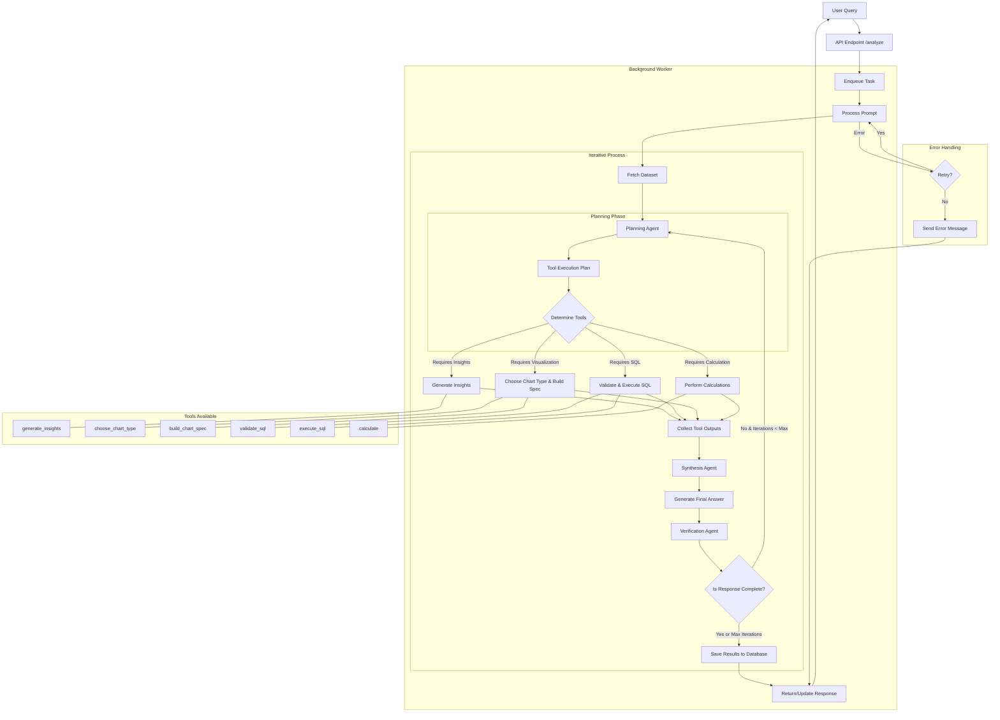

# Agentic Flow Logic

This document visualizes the flow of the flexible agentic system in the backend.

## Overview

The system uses a flexible agent architecture based on Pydantic AI to dynamically select and execute tools based on user queries. The agents are organized in a planning-execution-synthesis-verification pattern with iterative tool selection.

## Flowchart

## Detailed Flow Description

1. **User Input**: The process begins with a user query submitted to the API
2. **API Processing**: The FastAPI endpoint processes the request and enqueues a background task
3. **Background Processing**:
   - The worker fetches the dataset from the provided URL
   - **Iterative Tool Selection and Execution**:
     - The planning agent analyzes the user query and creates a plan
     - Tools are selected based on the plan requirements
     - All specified tools (primary and additional) are executed
     - Results from all tools are collected
     - The synthesis agent combines results into a coherent answer
     - The verification agent checks if the answer fully addresses the user query
     - If incomplete and iterations < max, return to planning with context of current results
   - Final results are saved to the database
4. **Response**: The results are returned to the user or the chat is updated

## Components

### Planning Agent
- Determines which tools to use based on the user query
- Creates a structured plan with primary and additional tools
- Sets flags for visualization, insights, and calculation requirements
- During iterations > 1, considers previously executed tools and their outputs

### Tools
- **generate_insights**: Analyzes data to generate natural language insights
- **choose_chart_type**: Determines appropriate chart type for visualization
- **build_chart_spec**: Creates complete chart specification 
- **validate_sql**: Validates SQL queries for safety and correctness
- **execute_sql**: Runs SQL queries against the data
- **calculate**: Performs calculations on the data

### Synthesis Agent
- Takes outputs from all executed tools
- Generates a comprehensive, coherent answer that addresses the user query
- Formats the response in a user-friendly way

### Verification Agent
- Checks if the generated answer fully addresses all aspects of the user query
- Returns TRUE if complete, FALSE if incomplete
- Helps determine if additional tool executions are needed

### Error Handling
- Implements retry logic for transient failures
- Provides clear error messages when processing fails
- Updates the chat with status information throughout processing 